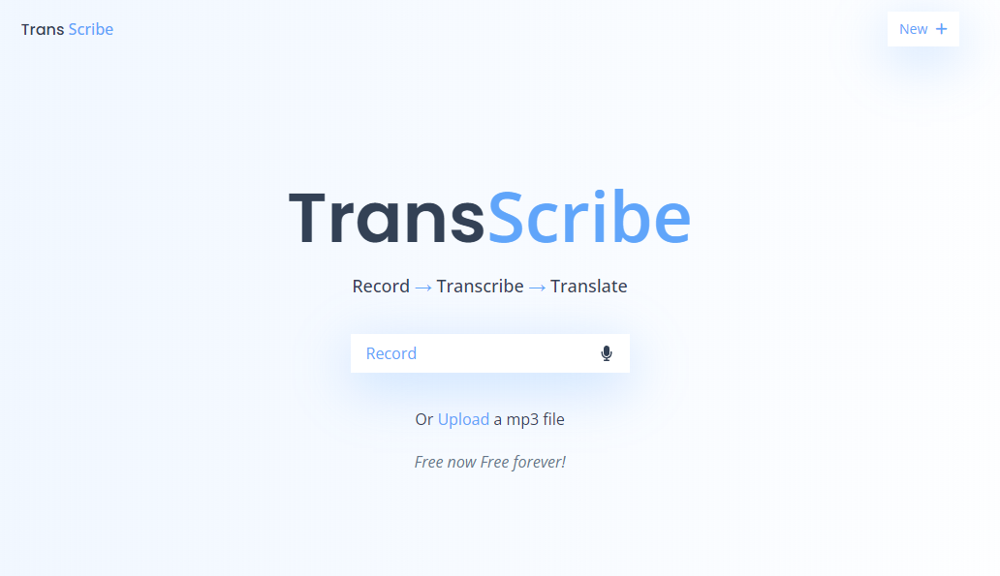

<div align="center">

# Free Speech to Text | Transcribe and Translate
<br />
<h2>Fully Responsive and built using React and tailwindCss</h2>
<a href="https://transcribe-ml-five.vercel.app">➥ Live Demo</a>
</div>

<a href="https://transcribe-ml-five.vercel.app">

</a>
This is a Machine Learning Project. which is used to transcribe and translate from Speech to Text. A React web based transcription & translation app that uses web workers to run ML models in the browser.

## No Cost and Unlimited 
Since the server runs locally on the browser there is no external cost for any API's. But please wait for some time when you are using for the first time to download all essential components to get you up and running.

## Run Locally
To run locally, run this command on your git bash:

```bash
https://github.com/Belsinghferrus/Transcribe-ML.git
```

## Community Channel
Subscribe to our [Youtube](https://www.youtube.com/@Ferruz_) Channel

## Contact
If you want to contact with me you can reach me at [LinkedIn](https://www.linkedin.com/in/belsingh-ferrus-660839212/)

